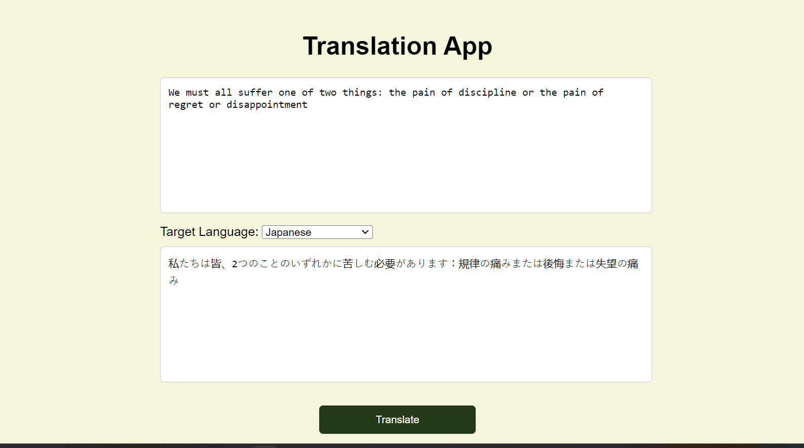

# Language Translation Tool

This is the third task in the [CodeAlpha](https://www.codealpha.tech/) AI internship.

This repository contains code that implements a language translator tool using Google Translation API pre-trained model. Simply I used **Flask** to create a simple route that calls the API. 


## Overview

The project is divided into the following files:

- `app.py`: module implements simple route to be able to access the Google API.
- `templates\index.html`: simple UI that binded to our route.
- `static\style.css`: simple design to style our UI. 


## Tools

- [Flask](https://flask.palletsprojects.com/en/3.0.x/)
- [googletrans](https://py-googletrans.readthedocs.io/en/latest/)


## Features

- Automatically detect the language of the source text.
- Translate to many languages like:
  - English
  - Arabic
  - Spanish
  - Chinese (Mandarin)
  - Hindi
  - French
  - Russian
  - Portuguese
  - Japanese
  - German
  - Swahili


## Demo




## Usage

1. Clone the repository:

    ```bash
    git clone git@github.com:mohamedhassan218/CodeAlpha_Translator.git
    ```

2. Create a Virtual Environment:
    ```bash
    python -m venv .venv
    ```

3. Activate the Virtual Environment:
    - On Windows:
        ```bash
        .venv\Scripts\activate
        ```

    - On Unix or MacOS:
        ```bash
        source .venv/bin/activate
        ```

4. Install dependencies:
    ```bash
    pip install -r requirements.txt
    ```

5. Setup your environment variable:
   ```.env
   SECRET_KEY=''
   ```

6. Run the main script:

    ```bash
    py app.py
    ```


## Contributing

Contributions are welcome! If you have any suggestions, bug fixes, or improvements, please feel free to open an issue or create a pull request.